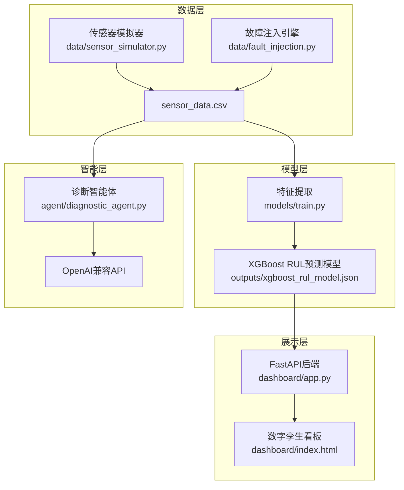

# 智能装备健康管理系统（IEHM）

工业设备预测性维护与智能诊断平台。模拟 3 台设备（数控机床 / 织布机 / 机械臂）的传感器时序数据，训练 XGBoost 模型预测剩余使用寿命（RUL），通过大模型 API 生成故障诊断报告，并以工业级 HMI 风格的数字孪生看板展示。

## 系统架构



## 技术栈

| 层次 | 技术 | 说明 |
|------|------|------|
| **语言** | Python 3.10+ | 项目主语言 |
| **数据** | NumPy, Pandas | 数据生成与处理 |
| **可视化** | Matplotlib, Seaborn | 时序图、热力图 |
| **机器学习** | XGBoost, scikit-learn | RUL 预测、交叉验证 |
| **后端** | FastAPI, Uvicorn | REST API 服务 |
| **前端** | HTML5, CSS3, JavaScript, ECharts | 工业 HMI 风格看板 |
| **大模型** | OpenAI 兼容 API | 故障诊断报告生成 |

## 项目结构

```
E:\Show work\auto prediction\
├── main.py                  # 统一CLI入口（数据生成 / 模型训练 / 看板启动）
├── requirements.txt         # 依赖列表
├── CLAUDE.md               # Claude Code 项目指南
│
├── data/                   # 数据模块
│   ├── __init__.py
│   ├── sensor_simulator.py # 传感器数据模拟器（3台设备×7天×4类传感器）
│   └── fault_injection.py  # 故障注入引擎与可视化（分布统计 / 时序图 / 热图）
│
├── models/                 # 模型模块
│   ├── __init__.py
│   └── train.py           # XGBoost训练（60步滚动窗口特征 / 5折时序交叉验证）
│
├── agent/                  # 智能体模块
│   ├── __init__.py
│   ├── diagnostic_agent.py # LLM诊断智能体（RUL<20%或3σ超阈值触发）
│   └── prompt_templates.py # Prompt 模板
│
├── dashboard/              # 看板模块
│   ├── __init__.py
│   ├── app.py             # FastAPI应用（REST API）
│   └── static/           # 前端资源（HTML/CSS/JS + ECharts）
│
├── outputs/               # 输出目录（自动创建）
│   ├── sensor_data.csv        # 传感器数据
│   ├── xgboost_rul_model.json # 训练好的模型
│   ├── feature_importance.png # 特征重要性图
│   └── prediction_scatter.png # 预测散点图
│
└── docs/                  # 文档目录
    └── interview_script.md   # 面试解说词（STAR方法）
```

## 快速开始

### 1. 安装依赖

```bash
pip install -r requirements.txt
```

### 2. 一键执行全流程

```bash
python main.py --all
```

等效于依次执行：

```bash
python main.py --generate-data   # 生成传感器数据
python main.py --train          # 训练预测模型
python main.py --dashboard       # 启动看板（访问 http://localhost:8000）
```

### 3. 分步执行

```bash
# 仅生成数据（不训练模型也不启动看板）
python main.py --generate-data

# 仅训练模型（如数据不存在则自动先生成数据）
python main.py --train

# 仅启动看板服务
python main.py --dashboard
```

### 4. 查看帮助

```bash
python main.py --help
```

## LLM API 配置

本系统支持 OpenAI 兼容 API 进行故障诊断报告生成。配置方式如下：

### 方式一：环境变量（推荐）

```bash
export OPENAI_API_KEY="your-api-key"
export OPENAI_BASE_URL="https://api.openai.com/v1"   # 可选，默认为 OpenAI 官方地址
export OPENAI_MODEL_NAME="gpt-4o-mini"               # 可选，默认为 gpt-4o-mini
```

### 方式二：.env 文件

在项目根目录创建 `.env` 文件：

```
OPENAI_API_KEY=your-api-key
OPENAI_BASE_URL=https://api.openai.com/v1
OPENAI_MODEL_NAME=gpt-4o-mini
```

### 方式三：代码配置

在调用 `DiagnosticAgent` 时通过参数传入：

```python
from agent.diagnostic_agent import DiagnosticAgent

agent = DiagnosticAgent(
    api_key="your-api-key",
    base_url="https://api.openai.com/v1",
    model_name="gpt-4o-mini"
)
```

> **注意**：如未配置 API Key，系统将自动回退至模板诊断模式，输出结构化的故障报告（不调用大模型）。

## 设备与故障类型

| 设备 ID | 设备名称 | 故障类型 | 触发时间 |
|---------|----------|----------|----------|
| CNC_001 | 数控机床 | 轴承磨损 / 转子不平衡 | 第5天开始 |
| LOOM_001 | 织布机 | 过热 / 皮带松动 | 第3天、第4.5天开始 |
| ARM_001 | 机械臂 | 轴承磨损 | 第4天开始 |

## 输出指标说明

### RUL 预测模型评估

- **R²（决定系数）**：模型对 RUL 变化的解释程度，越接近 1 越好
- **RMSE（均方根误差）**：预测误差的标准差，越小越好
- **MAE（平均绝对误差）**：预测误差的平均值，越小越好

### 交叉验证

采用 5 折 TimeSeriesSplit 交叉验证（时间序列不 shuffle），确保模型泛化能力。

## 访问看板

启动服务后，访问 http://localhost:8000 查看数字孪生看板：

- 设备状态概览（正常 / 告警）
- 传感器实时遥测（温度 / 振动 / 电流 / 转速）
- RUL 预测趋势
- 故障告警记录
- AI 诊断报告
